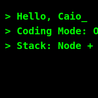

<p align="center">
  
</p>

<p align="center">
  
</p>

---

### 🧠 Sobre mim

```txt
💻 Dev fullstack apaixonado por código limpo, modularidade e automação.
🔧 Trabalho com Node.js, Fastify, Knex, Zod, React, SQLite e MySQL.
⚙️ Arquitetura escalável com separation of concerns e testes.
🎯 Missão: escrever menos e entregar mais valor!
```

---

### 🚀 Tech Stack

<p align="center">
  
</p>

---

### 📊 Estatísticas Visuais

<div align="center">
  
  
</div>

---

### 🔝 Linguagens

<p align="center">
  
</p>

---

### 🐍 Snake Game dos Commits

<p align="center">
  
</p>

---

### 🏆 Troféus GitHub

<p align="center">
  
</p>

---

### 🧭 Contato

<p align="center">
  <a href="https://linkedin.com/in/caio-souza" target="_blank"></a>
  <a href="mailto:caio@email.com"></a>
</p>

---

> "Código limpo é como um bom café: forte, direto e sem açúcar."
